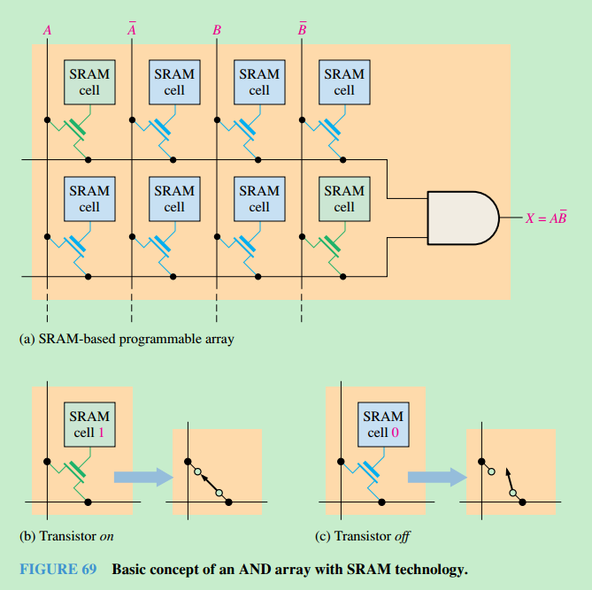

|术语| 详解|
|---|---|
|JTAG|Joint Test Action	group; an interface standard designated IEEE Std. 1149.1.|
|SDRAM|A type of PLD volatile reprogrammable link based on static random-access memory cells and can be turned on or off repeatedly with programming|
|Flash | A type of PLD nonvolatile reprogrammable link technology based on a single transistor cell.|
|PCB|printed circuit board|

### SDRAM

SRAM-based programmable logic arrays is illustrated in Figure 69(a). A SRAM-type memory cell is used to turn a transistor on or off to connect or disconnect rows and columns. For example, when the memory cell contains a 1 (green), the transistor is on and connects the associated row and column lines, as shown in part (b). When the memory cell contains a 0 (blue), the transistor is off so there is no connection between the lines, as shown in part (c).

  

