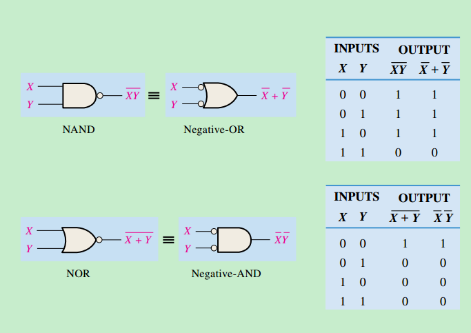
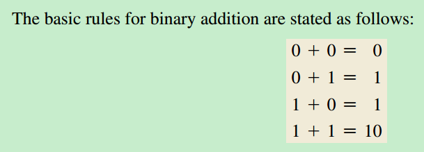
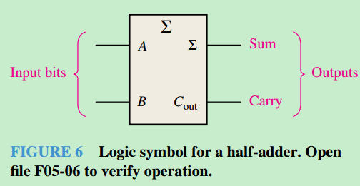
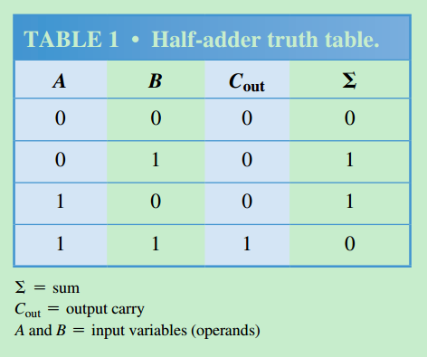
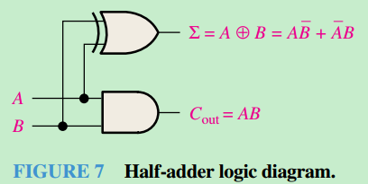
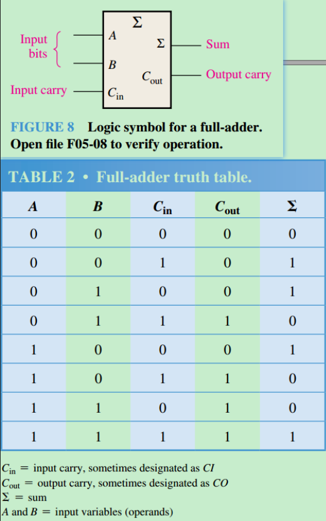
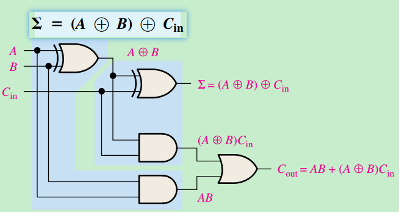
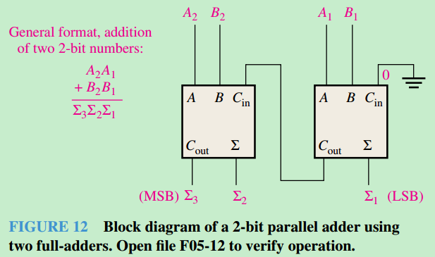

# 数学定律

## 1. 德摩根定律（De Morgan's Laws）
德摩根定律是布尔代数中的核心规则，用于逻辑表达式的转换，尤其在数字电路设计中广泛应用。

### 定律形式
1. **第一定律（非与 等价于 或非）**  
   $$
   \overline{ AB } = \overline{A}+\overline{B}
   $$
   - 电路实现：`NAND`门等价于`NOT A + NOT B`。

2. **第二定律（非或等价于与非）**  
   $
   \overline{A+B} = \overline{A} · \overline{B}
   $
   - 电路实现：`NOR`门等价于`NOT A · NOT B`。

### 应用场景
- 逻辑表达式简化
- 门级电路优化（如用`NAND`/`NOR`替代组合逻辑）


<div style="text-align: center;">
  
</div>

## 2. 其他常用运算规则
### 基本规则
 - **交换律**  
  $
  A + B = B \land A \quad \text{（AND）} \\
  A \lor B = B \lor A \quad \text{（OR）}
  $

- **结合律**  
  $
  (A \land B) \land C = A \land (B \land C) \\
  (A \lor B) \lor C = A \lor (B \lor C)
  $

- **分配律**  
  $
  A \land (B \lor C) = (A \land B) \lor (A \land C) \\
  A \lor (B \land C) = (A \lor B) \land (A \lor C)
  $

## 3. 代码实现示例（Verilog）
```verilog 
// NAND实现德摩根第一定律
module nand_de_morgan(input A, B, output Y);
  assign Y = ~(A & B);  // 等价于 (~A) | (~B)
endmodule

// NOR实现德摩根第二定律
module nor_de_morgan(input A, B, output Y);
  assign Y = ~(A | B);  // 等价于 (~A) & (~B)
endmodule
```


# 基本电路

## 1.Half-Adder

a half-adder adds **two bits** and produces a **sum** and an **output carry**.


<div style="text-align: center;">
    
</div>

A half-adder is represented by the logic symbol as follow
<div style="text-align: center;">
    
</div>

Half_Adder Truth table
<div style="text-align: center;">
    
</div>

<div style="text-align: center;">
    
</div>


## 2.Full-Adder

**the full-adder accepts two input bits and an input carry and generates a sum output and an output carry.**

<div style="text-align: center;">
    
</div>

**logic diagram**

<div style="text-align: center;">
    
</div>

## 3.Parallel ADDers
**two or more full-adders are connected to form parallel binary adders.**

<div style="text-align: center;">
    
</div>