- [数学定律](#数学定律)
  - [1. 德摩根定律（De Morgan's Laws）](#1-德摩根定律de-morgans-laws)
    - [定律形式](#定律形式)
    - [应用场景](#应用场景)
  - [2. 其他常用运算规则](#2-其他常用运算规则)
    - [基本规则](#基本规则)
  - [3. 代码实现示例（Verilog）](#3-代码实现示例verilog)
- [基本电路](#基本电路)
  - [1.Half-Adder](#1half-adder)
  - [2.Full-Adder](#2full-adder)
  - [3.Parallel ADDers](#3parallel-adders)
    - [Four-bit Parallel adders](#four-bit-parallel-adders)
    - [Eight-bit Parallel adders](#eight-bit-parallel-adders)
  - [Encoder](#encoder)
    - [BCD Encoder](#bcd-encoder)
    - [Multiplexers (Data selectors)](#multiplexers-data-selectors)
    - [Demultiplexers](#demultiplexers)
    - [Parity generators/checkers](#parity-generatorscheckers)
  - [Latch](#latch)
    - [SR锁存器（Set-Reset Latch）](#sr锁存器set-reset-latch)
    - [D锁存器（Data Latch）](#d锁存器data-latch)
    - [JK触发器](#jk触发器)
  - [FLip-FLop operating Characteristics](#flip-flop-operating-characteristics)
    - [Propagation delay times](#propagation-delay-times)
    - [Set-up Time](#set-up-time)
    - [Hold Time](#hold-time)


# 数学定律

## 1. 德摩根定律（De Morgan's Laws）
德摩根定律是布尔代数中的核心规则，用于逻辑表达式的转换，尤其在数字电路设计中广泛应用。

### 定律形式
1. **第一定律（非与 等价于 或非）**  
   $$
   \overline{ AB } = \overline{A}+\overline{B}
   $$
   - 电路实现：`NAND`门等价于`NOT A + NOT B`。

2. **第二定律（非或等价于与非）**  
   $
   \overline{A+B} = \overline{A} · \overline{B}
   $
   - 电路实现：`NOR`门等价于`NOT A · NOT B`。

### 应用场景
- 逻辑表达式简化
- 门级电路优化（如用`NAND`/`NOR`替代组合逻辑）


<div style="text-align: center;">
  
</div>

## 2. 其他常用运算规则
### 基本规则
 - **交换律**  
  $
  A + B = B \land A \quad \text{（AND）} \\
  A \lor B = B \lor A \quad \text{（OR）}
  $

- **结合律**  
  $
  (A \land B) \land C = A \land (B \land C) \\
  (A \lor B) \lor C = A \lor (B \lor C)
  $

- **分配律**  
  $
  A \land (B \lor C) = (A \land B) \lor (A \land C) \\
  A \lor (B \land C) = (A \lor B) \land (A \lor C)
  $

## 3. 代码实现示例（Verilog）
```verilog 
// NAND实现德摩根第一定律
module nand_de_morgan(input A, B, output Y);
  assign Y = ~(A & B);  // 等价于 (~A) | (~B)
endmodule

// NOR实现德摩根第二定律
module nor_de_morgan(input A, B, output Y);
  assign Y = ~(A | B);  // 等价于 (~A) & (~B)
endmodule
```


# 基本电路

## 1.Half-Adder

a half-adder adds **two bits** and produces a **sum** and an **output carry**.


<div style="text-align: center;">
    
</div>

A half-adder is represented by the logic symbol as follow
<div style="text-align: center;">
    
</div>

Half_Adder Truth table
<div style="text-align: center;">
    
</div>

<div style="text-align: center;">
    
</div>


## 2.Full-Adder

**the full-adder accepts two input bits and an input carry and generates a sum output and an output carry.**

<div style="text-align: center;">
    
</div>

**logic diagram**

<div style="text-align: center;">
    
</div>

## 3.Parallel ADDers
**two or more full-adders are connected to form parallel binary adders.**

<div style="text-align: center;">
    
</div>

### Four-bit Parallel adders

<div style="text-align: center;">
    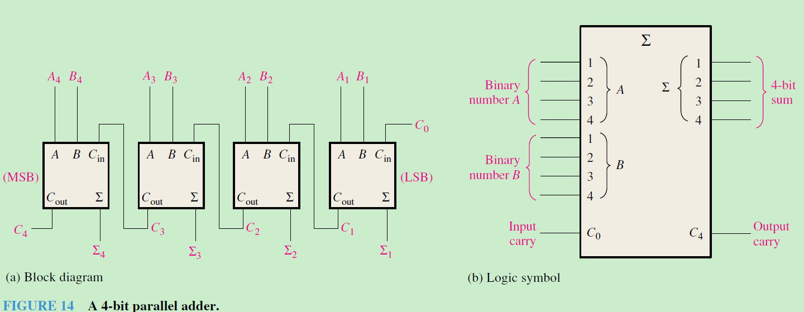
</div>

### Eight-bit Parallel adders

<div style="text-align: center;">
    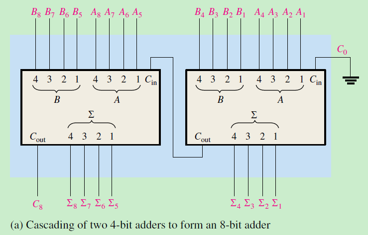
</div>


## Encoder

编码器（encoder）是一种组合逻辑电路，其功能本质上是译码器（decoder）的“反向”操作。编码器在某一个输入端接收到一个有效电平，表示一个数字（例如十进制或八进制数字），然后将其转换为一个编码输出，例如 BCD（二-十进制码）或二进制。编码器也可以用于对各种符号或字母字符进行编码。将熟悉的符号或数字转换为编码格式的过程称为编码（encoding）。

### BCD Encoder
<div style="text-align: center;">
    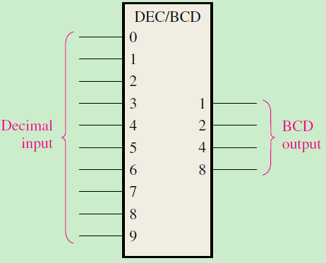
</div>
<div style="text-align: center;">
    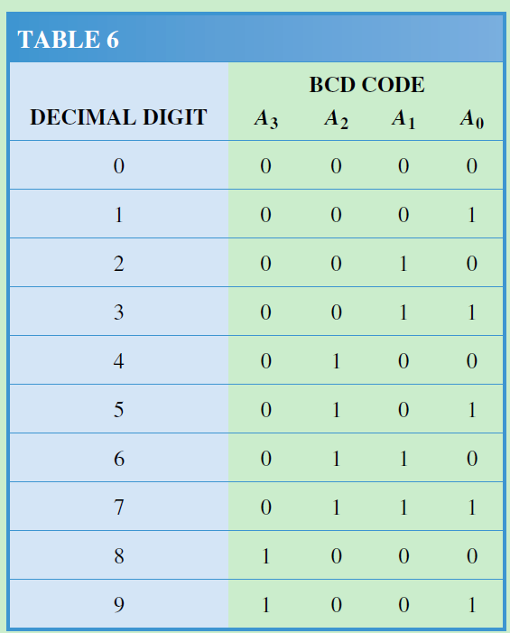
</div>
<div style="text-align: center;">
    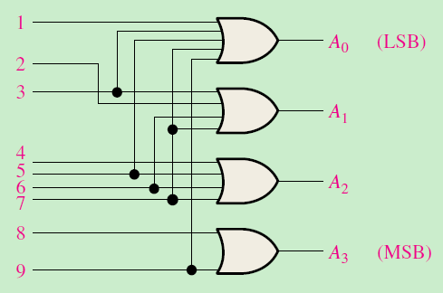
</div>


### Multiplexers (Data selectors)

<div style="text-align: center;">
    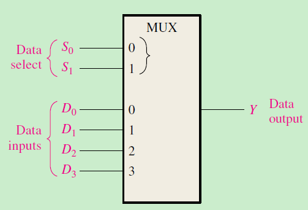
</div>
<div style="text-align: center;">
    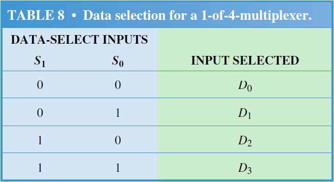
</div>
<div style="text-align: center;">
    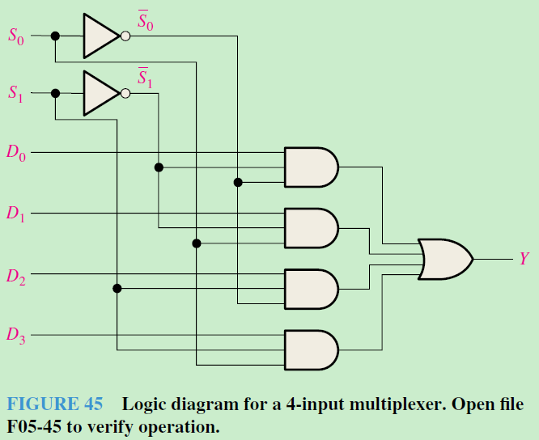
</div>

### Demultiplexers

<div style="text-align: center;">
    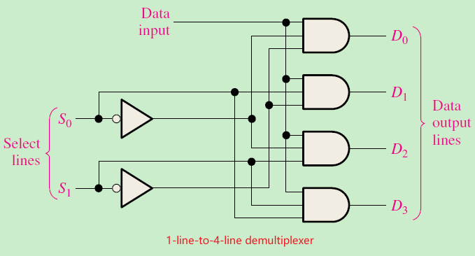
</div>
<div style="text-align: center;">
    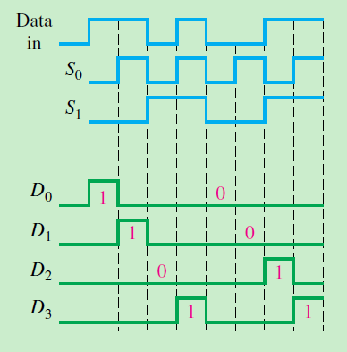
</div>


### Parity generators/checkers

<div style="text-align: center;">
    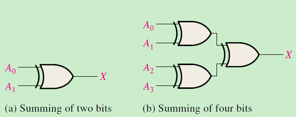
</div>

<div style="text-align: center;">
    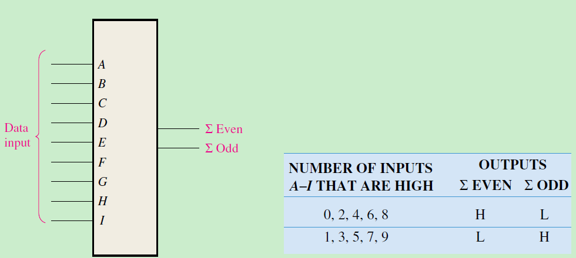
</div>

<div style="text-align: center;">
    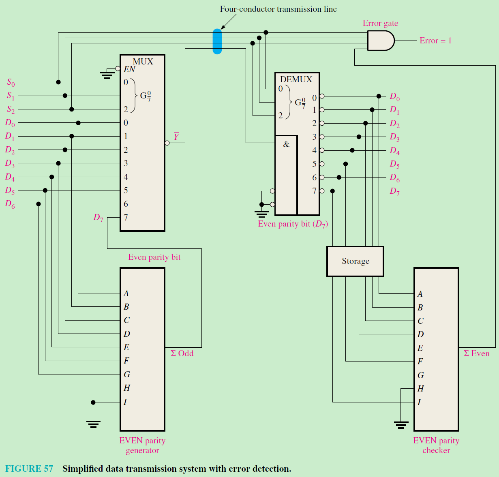
</div>


## Latch

### SR锁存器（Set-Reset Latch）

<div style="text-align: center;">
    
</div>
<div style="text-align: center;">
    
</div>

<div style="text-align: center;">
    
</div>
<div style="text-align: center;">
    
</div>

Gate SR latch
<div style="text-align: center;">
    
</div>

<div style="text-align: center;">
    
</div>


### D锁存器（Data Latch）
- **特性**：解决SR锁存器的禁止状态问题
- **逻辑表达式**：Q = EN·D + EN'·Q_prev


### JK触发器

<div style="text-align: center;">
    
</div>


<div style="text-align: center;">
    
</div>

<div style="text-align: center;">
    
</div>

## FLip-FLop operating Characteristics
### Propagation delay times

传播延迟时间的定义
传播延迟时间是指从输入信号施加到相应输出发生变化所需的时间间隔。

<div style="text-align: center;">
    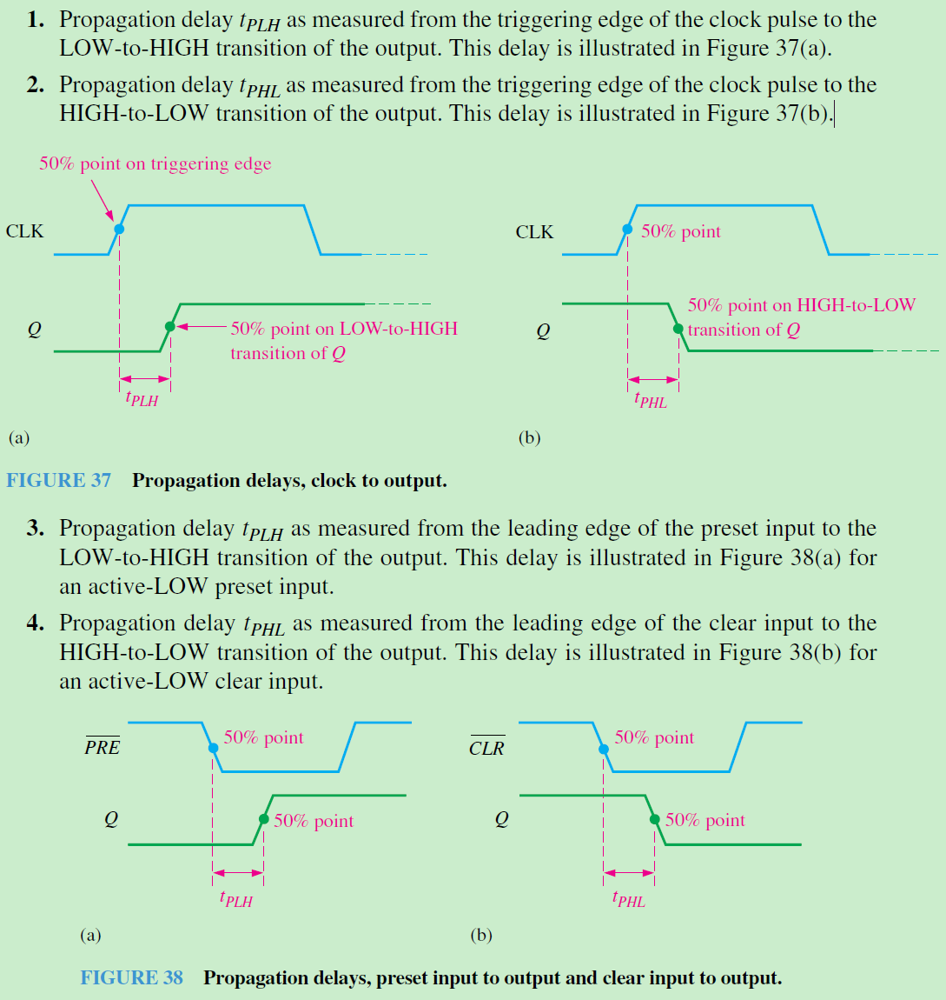
</div>

### Set-up Time

**建立时间**（$t_s$） 是指在时钟脉冲的触发边沿到来之前，输入端（如 J 和 K，或者 D）的逻辑电平必须保持**稳定不变**的**最短时间间隔**，这样才能确保这些电平被可靠地锁存到触发器中。

<div style="text-align: center;">
    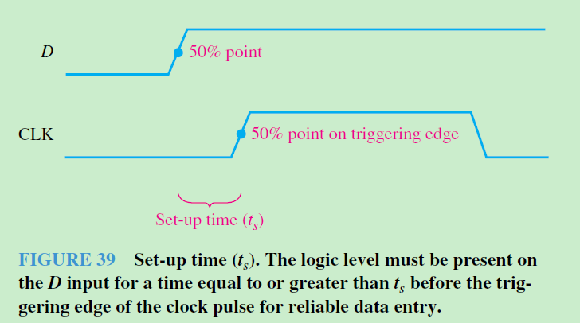
</div>


### Hold Time

**保持时间**（$t_H$）是指在时钟脉冲的触发边沿到来之后，输入端（例如 D、J、K 输入）的逻辑电平必须继续**保持不变**的**最短时间间隔**，以确保这些电平能够被可靠地锁存到触发器中。

<div style="text-align: center;">
    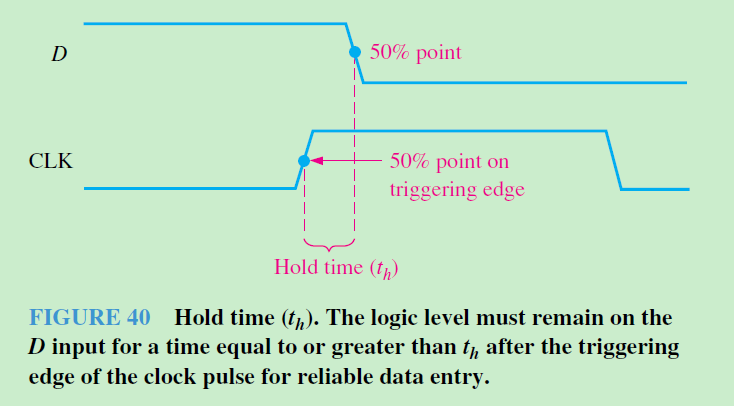
</div>