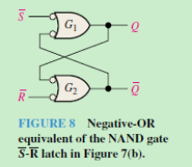
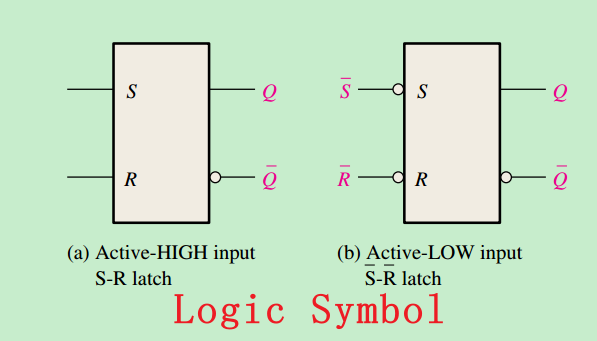
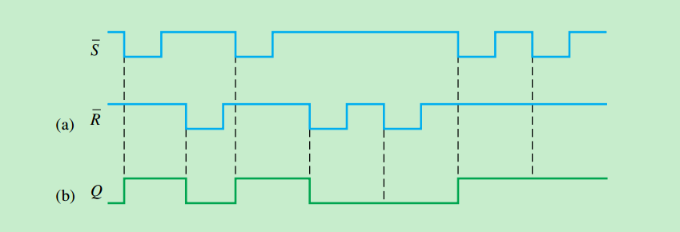
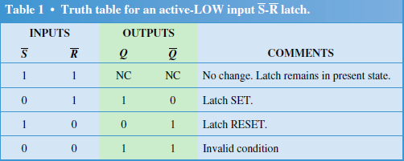
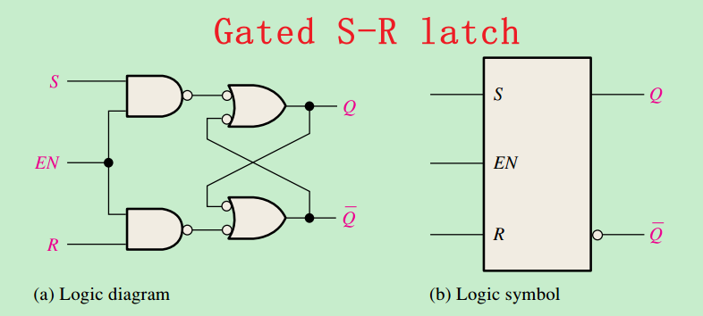
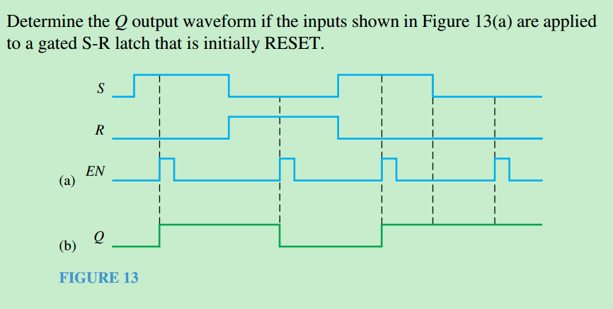
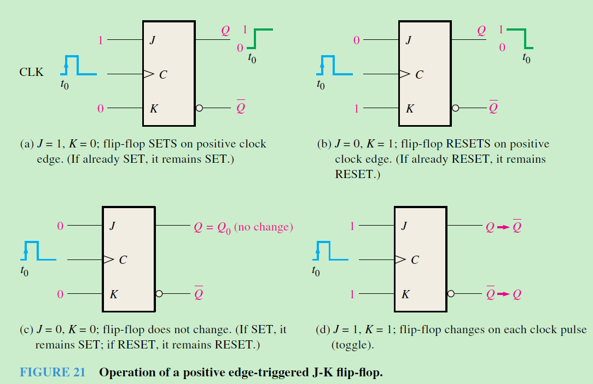
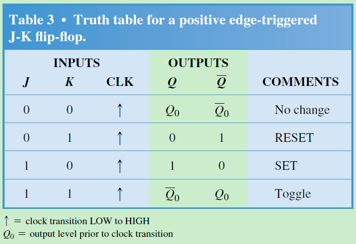
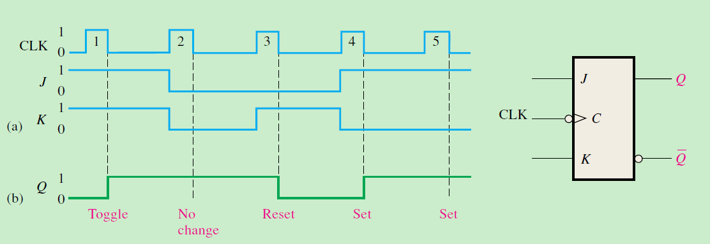

- [锁存器（Latch）知识文档](#锁存器latch知识文档)
  - [1. 基本概念](#1-基本概念)
  - [2. 常见类型](#2-常见类型)
    - [2.1 SR锁存器（Set-Reset Latch）](#21-sr锁存器set-reset-latch)
    - [2.2 D锁存器（Data Latch）](#22-d锁存器data-latch)
    - [2.3 JK触发器](#23-jk触发器)
  - [3. 工作原理](#3-工作原理)
  - [4. 锁存器 vs 触发器](#4-锁存器-vs-触发器)
  - [5.实际应用](#5实际应用)


# 锁存器（Latch）知识文档

## 1. 基本概念
锁存器是一种**电平触发**的存储单元，用于在数字电路中临时存储1位二进制数据。与触发器（Flip-Flop）不同，锁存器对输入信号的**电平敏感**而非边沿敏感。

## 2. 常见类型
### 2.1 SR锁存器（Set-Reset Latch）
- **电路结构**：由两个交叉耦合的NOR或NAND门构成


SR latch

<div style="text-align: center;">
    
</div>
<div style="text-align: center;">
    
</div>

<div style="text-align: center;">
    
</div>
<div style="text-align: center;">
    
</div>

Gate SR latch
<div style="text-align: center;">
    
</div>

<div style="text-align: center;">
    
</div>


### 2.2 D锁存器（Data Latch）
- **特性**：解决SR锁存器的禁止状态问题
- **逻辑表达式**：$Q = EN·D + \bar{EN}·Q_{prev}$

||||
|-|-|-|
|端口|名称|描述|
|D|Data (数据输入)|存储的输入数据位。|
|CLK|	Clock (时钟)|	控制数据何时被锁存到输出端。|
|Q	|Output (主输出)|	触发器当前存储的值。|
|Not Q| 	Not Q (反相输出)	|Q 的逻辑非（ Q = 非 Q）。|


### 2.3 JK触发器

<div style="text-align: center;">
    
</div>


<div style="text-align: center;">
    
</div>

<div style="text-align: center;">
    
</div>


## 3. 工作原理
```verilog
// Verilog示例代码
module d_latch(
  input en, d,
  output reg q
);
always @(en or d)
  if(en) q = d; // 电平敏感
endmodule
```

## 4. 锁存器 vs 触发器

|特性	|锁存器	|触发器|
|---|---|---|
|触发方式	|电平敏感	|边沿敏感|
|时序控制	|易产生毛刺	|更稳定|
|应用场景	|异步电路	|同步电路|

## 5.实际应用

 - 总线保持电路
 - 按键消抖电路
 - 临时数据缓存